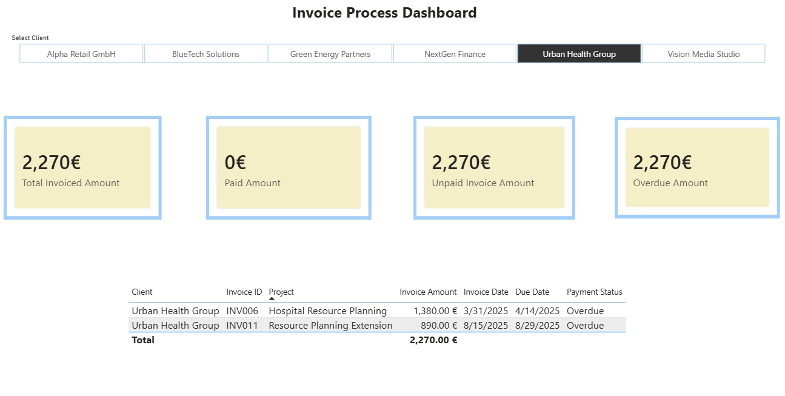
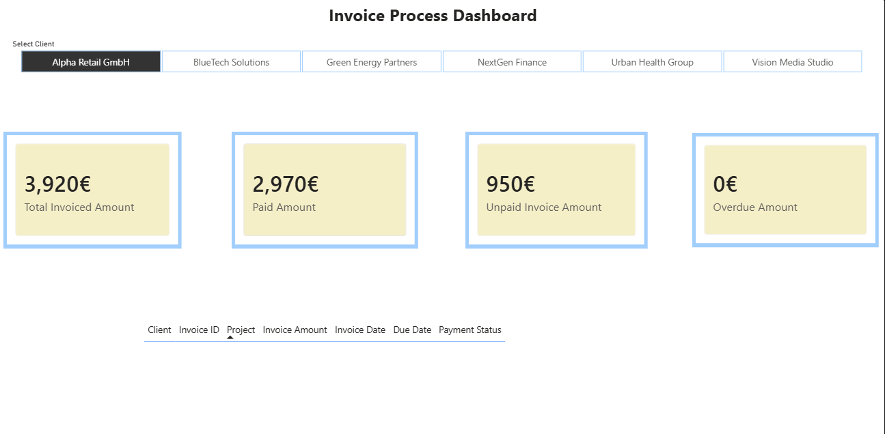

# Invoice Payment Process Analysis

This is a personal portfolio project I built to practice SQL-based invoice tracking, payment monitoring, and collection reporting.

The project uses a small simulated business dataset with client, project, invoice, and payment data. I used SQL to explore the data, create payment-related summary tables, and then built both an Excel dashboard and a Power BI dashboard to review account-level invoice and overdue information.

## Dashboard Preview

### Excel example with overdue invoices

### Excel example without overdue invoices

### Power BI example with overdue invoices

### Power BI example without overdue invoices

## Project Focus

This project looks at questions such as:

- How many invoices are paid, pending, or overdue?
- Which clients have the highest unpaid invoice amounts?
- Which invoices are overdue?
- How does invoice status vary by client?
- How can invoice and overdue information be reviewed at client level in a simple dashboard?

## Dataset

The project uses four source tables:

- `clients.csv`
- `projects.csv`
- `invoices.csv`
- `payments.csv`

## Tools Used

- SQL
- Excel
- Power Pivot
- Power BI
- GitHub

## SQL Skills Used

- `SELECT`
- `WHERE`
- `GROUP BY`
- `ORDER BY`
- `LEFT JOIN`
- `CASE WHEN`
- aggregate functions such as `SUM()` and `COUNT()`
- basic payment status and overdue analysis

## Dashboard Content

The project includes both an Excel version and a Power BI version of the dashboard.

Main dashboard elements include:

- client slicer
- total invoiced amount
- paid amount
- unpaid amount
- overdue amount
- overdue invoice details for the selected client

## Files

### Data
- `data/clients.csv`
- `data/projects.csv`
- `data/invoices.csv`
- `data/payments.csv`

### SQL
- `sql/01_invoice_exploration.sql`
- `sql/02_payment_status_analysis.sql`
- `sql/03_unpaid_exposure_by_client.sql`
- `sql/04_payment_delay_analysis.sql`
- `sql/05_account_payment_summary.sql`
- `sql/06_overdue_invoice_summary.sql`
- `sql/07_payment_collection_dashboard_summary.sql`

### Images
- `images/invoice_collection_dashboard_excel_overdue_example.png`
- `images/invoice_collection_dashboard_excel_no_overdue_example.png`
- `images/invoice_collection_dashboard_powerBI_overdue_example.png`
- `images/invoice_collection_dashboard_powerBI_no_overdue_example.png`

## What I Practiced

- exploring invoice and payment data with SQL
- summarizing unpaid and overdue exposure by client
- joining invoice and payment records
- building client-level dashboards in Excel and Power BI
- working with slicers, KPI cards, and invoice detail views
- presenting the work in a portfolio format on GitHub

## Author

Ruomeng Xu
